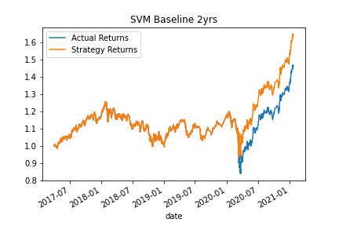

# Algorithmic Trading

**Overview**
----
The program was designed to improve the existing algorithmic trading systems and maintain the firm’s competitive advantage in the market. In order to enhance the existing trading signals with machine learning algorithms that can adapt to new data, the following was accomplished:

- Establish a Baseline Performance

- Tune the Baseline Trading Algorithm

- Evaluate a New Machine Learning Classifier

- Create an Evaluation Report

**Requirements**
----
This project leverages python 3.7 and scikit-learn.

A conda environment with liabraries listed below and Jupyter Notebook/Lab are required to run the code.

The following library was used:

Scikit Learn - Scikit Learn or Sklearn is one of the most used Python libraries for Data Science, along with others like Numpy, Pandas, Tensorflow, or Keras.
Install the following librarie(s) in your terminal.
```
pip install -U scikit-learn
```

**Data**
----
The data used in this neural network model was from derived from a CSV file called emerging_markets_ohlcv.csv

**Visualization**
----
**Baseline Performance**

In this assignment, we first evaluate a baseline performance using SVM binary classifier with a training time window of 3 months and the SMA parameters set as 4 and 100 as short-term and long-term window respectively. This baseline model has a cumulative strategy return of 1.517 and the comparison plot for the baseline and actual return is shown as following:


**Tune the training algorithm by adjusting the size of the training dataset**

By adjust the size of the training dataset, we got a better cumulative strategy return of `1.842` and `1.643` for 6 months and 2 years respectively, which are both higher than the baseline. The comparison plots for the two different sizes of training dataset is shown as follow:




**Tune the trading algorithm by adjusting the SMA input features**

In this experiment, we iterated the SMA input features and selected the best set of parameters to report here. To ensure the experiment is in a comparable fashion, we use 3 months data as the training dataset, which is same to the baseline. For the SMA parameters iterations, let short-term window iterated from 1 to 20, and let long-term window iterated from 80 to 280 with a increment of 10. We selected the best SMA parameters based on the cumulative strategy return and according to our analysis, the best return yielded by `short-term window=1`, `long-term window=130` and its cumulative strategy return is `1.782`. The comparison plots for this best model and actual return is shown as following:


**Evaluate a New Machine Learning Classifier**

In this part, we selected `DecisionTreeClassifier` from `sklearn` as the new classifier. To evaluate such algorithm, we repeated the experiment in the previous step and got the best return when `short-term window=2`, `long-term window=170` and its cumulative strategy return is `2.414`. The comparison plots for this best model and actual return is shown as following:


